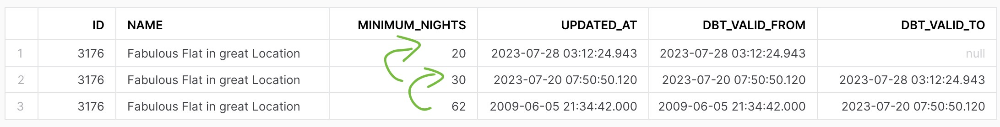

# dbt Bootcamp on Udemy
**Objective:** to learn dbt by transforming real-world Airbnb data from Berlin, Germany.
</br>
This course was made by: Zoltan and Miklos on [Udemy](https://www.udemy.com/course/complete-dbt-data-build-tool-bootcamp-zero-to-hero-learn-dbt).
</br>
</br>
Snowflake was used as the data warehouse while dbt was the data transformation layer.
</br>
</br>
Please scroll down to see examples of work, a dashboard, and lessons learned.

## End result
### Data model
Great quality raw data was read into the source files, adjusting the column names for consistency. The data was cleaned and parsed, then joined into new views/tables/ephemeral materializations.
</br>


### Data after undergoing transformation:
#### dim_listings_w_hosts

#### mart_fullmoon_reviews


</br>

## The source databases:


</br>


## Libraries and examples of work done:
### libraries used:
```yaml
packages:
  - package: dbt-labs/dbt_utils
    version: 0.8.0

  - package: calogica/dbt_expectations
    version: [">=0.8.0", "<0.9.0"]

  - package: dbt-labs/codegen
    version: 0.9.0

```
</br>

### Cleansing data using SQL and Jinja
```sql
-- if the 'host_name' is missing, then use 'Anonymous'
  NVL(host_name, 'Anonymous')
  AS host_name,
```
```sql
 -- cleanse 'minimum_nights' and ensure '0' nights is understood as '1'
  CASE
	WHEN minimum_nights = 0 THEN 1
    ELSE minimum_nights
  END AS minimum_nights
```
```sql
 -- parse the string 'price' into a number w/ 2 decimals
  REPLACE(price_str,'$') :: NUMBER(10,2)
  AS price
```
```sql
-- adding a new column that hashes 4 others using a jinja macro
  {{dbt_utils.surrogate_key(['listing_id', 'review_date', 'reviewer_name', 'review_text'])}}
  AS review_id

```
</br>

### Tests: custom, built-in, external packages

```sql
-- Custom made test, as a takehome assignment:
-- Checks that there is no review date that is submitted before its listing was created
-- Make sure that every review_date in fct_reviews is more recent than the associated created_at in dim_listings_cleansed



SELECT * FROM  {{ ref('dim_listings_cleansed') }} lc
INNER JOIN {{ ref('fct_reviews') }} f
USING (listing_id)
WHERE f.review_date < lc.created_at


```

```yaml
# regular expression checking if source input string is formatted well
- dbt_expectations.expect_column_values_to_match_regex:
	regex: "^\\\\$[0-9][0-9\\\\.]+$"
```

```yaml
# outlier test,  whether 99% of the values fall in the chosen range
- dbt_expectations.expect_column_quantile_values_to_be_between:
	quantile: .99
	min_value: 50
	max_value: 500
```
</br>

### Example of Snapshots
```sql
-- A snapshot of the raw listings data, to monitor and keep track of all past versions



{{
   config(
       target_schema='dev',
       unique_key='id',
       strategy='timestamp',
       updated_at='updated_at',
       invalidate_hard_deletes=True
   )
}}
-- invalidate_hard_deletes - deletes are monitored too
-- strategy, updated_at - monitor by timestamp (by updated_at)


SELECT * FROM {{ source('airbnb', 'listings') }}


```
### Snapshot @ change in minimum_nights:

</br>


### Dashboard summary
Built using Preset.io
</br>

</br>

## Conclusion
The course took about a week and I can fully recommend it.
</br>

**Learned lessons:**
* Theory behind the data science process, the advantages of dbt
* Using VCS, a Python venv, installing dbt and key plugins
* Cleansing and doing operations on data through intermediate SQL
* Models and materializations
* Snapshots and source freshness
* Tests: built-in and custom made
* External packages and Macros
* asd
* Documentation: best practices for writing and building documentation, including the Docs block
</br>

**Note:** </br>
Everything in this repository was written by me, sometimes by following video lectures, other times ahead of the lecture. At least 3 of the models / docs / test files were individual assignments.
</br>


## How to: run it yourself
### Work in progress

## Actual documentation:
### Work in progress
